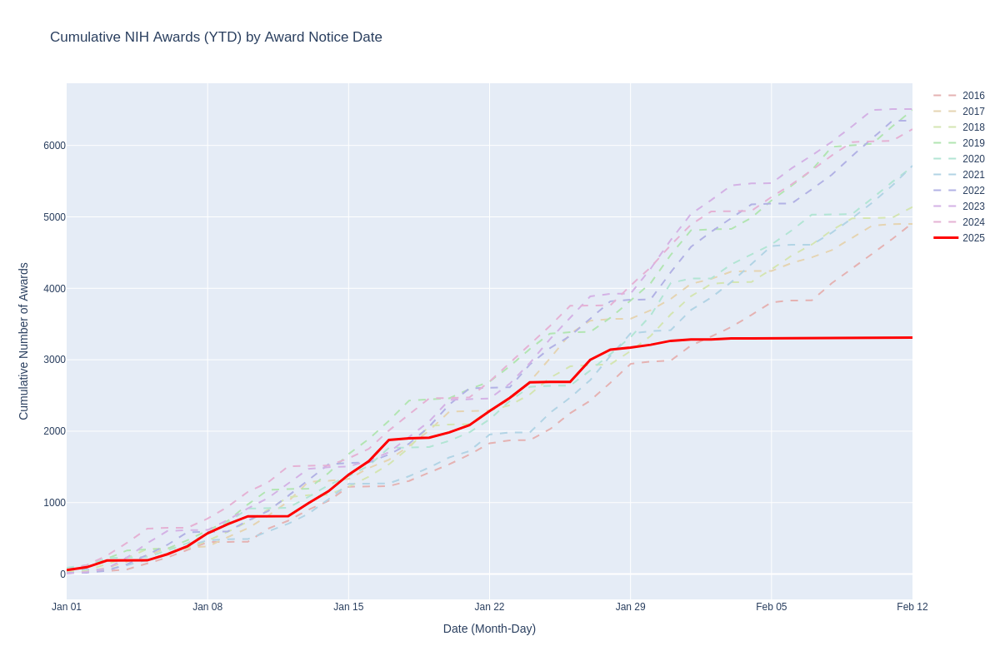

# NIH RePORTER reporter
Like the 80s band Mister Mister, this is the RePORTER reporter. It generates a plot of cumulative grant awards announced in NIH RePORTER by date, comparing the current year to the previous nine. This can identify trends in award disbursement.

It uses the RePORTER API to retrieve all grants by `award_notice_date` and then creates the output graph. I think that this includes awards that both newly awarded and those that are receiving funding in subsequent years.

This should update daily, though I'm new to using GitHub Actions.

## Caveats
- There may be delays between award notices sent to investigators and their appearance in RePORTER, so that may introduce artifactual lag for the most recent days.
- I am not an expert on NIH RePORTER and rely on `award_notice_date` as an indicator. There may be subtleties to how RePORTER works that distorts these results.
- One of the grant months didn't load correctly initially and I had to repopulate it by regenerating the cache. If there are flatlines for any month, please let me know so I can check for an error in the API call results.

## Latest Cumulative Awards Plots

<a href="https://dhoconno.github.io/reporter/nih_awards.html" target="_blank">Interactive Version (opens in new tab)</a>

## Acknowledgements
- ChatGPT o3-mini-high and Claude Sonnet assisted with deciphering the RePORTER API format and preparing the plots and GitHub Actions.