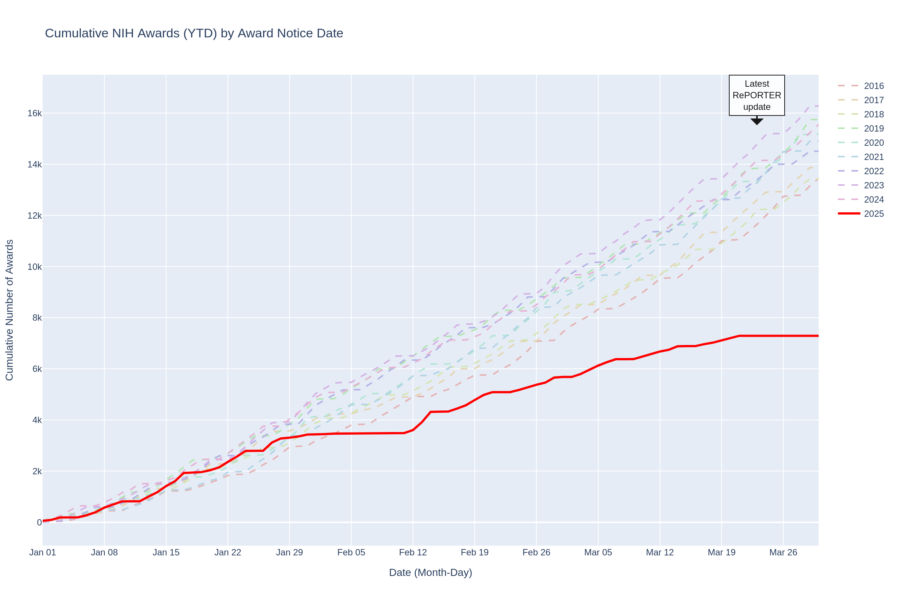
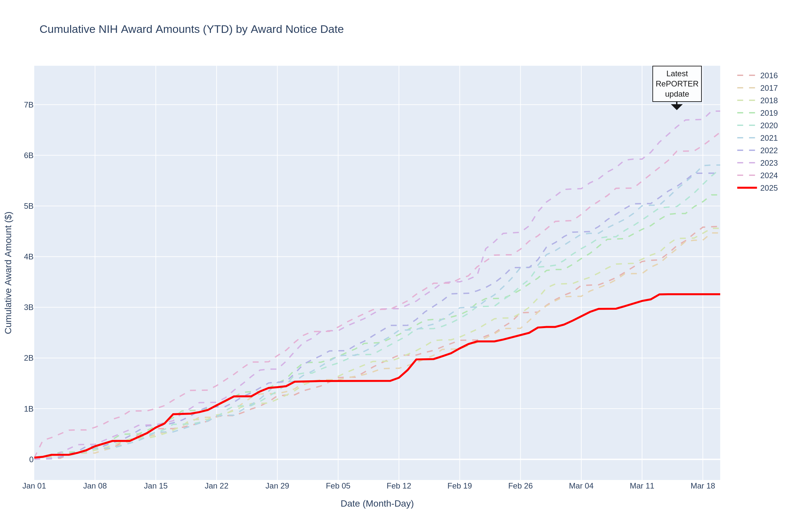
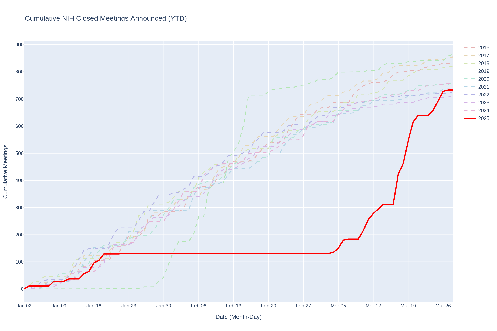

# NIH RePORTER reporter
Like the 80s band [Mr. Mister](https://youtu.be/9NDjt4FzFWY?si=Xc0q9_-9YjigdgIX), this is the RePORTER reporter. It generates a plot of cumulative grant awards announced in [NIH RePORTER](https://reporter.nih.gov) by date, comparing the current year to the previous nine. This can identify trends in award disbursement.

It uses the [RePORTER API](https://api.reporter.nih.gov) to retrieve all grants by `award_notice_date` and then creates the output graph. I think that this includes awards that are both newly awarded and non-competing renewals.

Based on a spot check of NIH RePORTER web captures in the [Internet Archive Wayback Machine](https://web.archive.org/web/20241206064251/https://reporter.nih.gov/) data is refreshed on Sundays. Therefore, I only plot grants through the start of the current week.

I welcome feedback and corrections if you find any mistakes!

## Now with 100% more federal register
Under the [Federal Advisory Committee Act](https://www.gsa.gov/policy-regulations/policy/federal-advisory-committee-management/legislation-and-regulations/federal-advisory-committee-act) study sections that review NIH grants need to be announced in the [Federal Register](https://www.federalregister.gov) at least 15 days before the study section meets. I parsed the meetings from Federal Register notices and created plots comparing the current year to the previous nine years.

## Latest Cumulative Award Count Plot

[Interactive Version (Award Counts)](https://dhoconno.github.io/reporter/nih_awards.html)

## Latest Cumulative Award Amount Plot

Inspired by [this analysis in the NYT](https://www.nytimes.com/2025/02/14/health/national-institutes-of-health-research-grants.html), I've also added plots of funding amounts to the plots.

[Interactive Version (Award Amounts)](https://dhoconno.github.io/reporter/nih_award_amounts.html)

## Latest Federal Register Study Section Announcements Plot

[Interactive Version (Federal Register Study Section Announcements)](https://dhoconno.github.io/reporter/nih_fr_meetings.html)

## Notes and caveats
- There may be delays between award notices sent to investigators and their appearance in RePORTER, so that may introduce artifactual lag for the most recent days.
- I am not an expert on NIH RePORTER and rely on `award_notice_date` as an indicator. There may be subtleties to how RePORTER works that distort these results.
- One of the grant months didn't load correctly initially and I had to repopulate it by regenerating the cache. If there are flatlines for any month, please let me know so I can check for an error in the API call results.
- I'm a virologist, not a proper data scientist. So I welcome any and all constructive feedback from those who find problems or areas of improvement.
- I'm spot checking the results but there is no guarantee of accuracy.
- On 2025-02-13 I tried to compress the cache files and use smarter logic to find new grants, but for several hours the display had information that I don't think was accurate. I reverted the code and as of 2025-02-13 the number of 2025 grants matches the number retrieved from the web RePORTER interface (3309). I spot checked the same date range in 2020 and the plot shows the same value as the web interface (5937). The date range on the web search is set to 2020-01-01 to 2020-02-14 and I'm not ssure how this search handles boundary dates, though the numbers match exactly.
- This week (2025-02-19), there is a difference between the number of awards retrieved by the API (3,731) and what I see in a web search of RePORTER (3,737) for 2025. I don't know how to reconcile this without going through each web result individually. Happy to take suggestions. For now, just know there is a small difference between the data shown here and the web interface. I intend to follow-up again after the next data push on Sunday.
- From the RePORTER data update on 2024-02-23, there are 4,061 awards in the web search of RePORTER and 4,058 from my API search. Still very similar, but a small discrepancy nonetheless (same as last week)
- On 2025-02-24 I added a breakdown by Institute/Center to the interactive plots. Click on a date in the interactive plot to bring up an inset graph. I spot checked it against NIAID awards for 2025 to date. Both the web RePORTER and my tool report 519 grants year-to-date. I did not have a good way to check cumulative funding. The logic is the same so it _should_ be OK but is untested. Use at your own risk. Thanks to the new Claude Sonnet 3.7 for crafting inset graphing code.
- On 2025-03-01 I added a CSV output that shows the underlying data used for the RePORTER analyses. The JSON data contains gull grant information and can be used by others to generate other types of plots. The CSV output is .zst compressed.
- On 2025-03-03 I noticed that last week's move between February and March caused an underreporting of grants awarded in the last week of February in the current year. The web RePORTER was showing ~5600 grants and this code was only showing ~4000. Unlike previous weeks, this was a significant discrepancy. This should now be fixed. Also, many grants with an award date in 2025 were added to RePORTER last week.

## Methodology (generated by Claude Sonnet 3.7)

The NIH grant award visualization script retrieves funding data directly from the NIH RePORTER API using a day-by-day accumulation methodology. The script queries the API for all grants with award notices issued between the start of each calendar year and the most recent Monday, going back ten years from the current year. For each grant, it extracts the award date, amount, and administering institute (IC) information. The system implements a seven-day caching mechanism to minimize API calls while ensuring data freshness, with current-month data always being refreshed. The script generates two cumulative plots: one for award counts and another for award amounts, both following year-to-date (YTD) progression. Each plot includes interactive elements allowing users to click on any point to view a detailed breakdown of funding by NIH Institute or Center for that specific date. The visualization distinguishes the current year with a solid red line, while previous years appear in pastel colors with dashed lines. All raw data is also exported to a single comprehensive CSV file containing year, date, cumulative metrics, and IC-specific breakdowns, then compressed using zstandard at maximum compression level to conserve space while maintaining analytical accessibility.

The Federal Register meeting analysis script systematically extracts and visualizes "Notice of Closed Meeting" announcements published by NIH institutes. The methodology involves querying the Federal Register's API for NIH documents containing specific title patterns related to closed meetings, processing publications from the start of each calendar year through the current date. The script downloads and parses each document's content using available XML, raw text, or HTML formats, applying regular expression patterns to extract meeting details including committee names, dates, and associated institutes. A comprehensive caching system captures both search results and document content to improve efficiency and reduce server load. The cumulative visualization plots the running total of closed meeting announcements by publication date for multiple years, with the current year highlighted in red and previous years in pastel colors. Unlike the NIH grant award script which uses weekly cutoffs, this analysis includes data through the current day to reflect the Federal Register's daily update schedule. The finished visualization maintains consistent dimensions (1200x800 pixels) and resolution with the grant award plots for visual coherence. All extracted meeting data is compiled into a single CSV file containing publication dates, committee names, meeting dates, and institute information, then compressed using zstandard compression to optimize storage while preserving all details necessary for reproduction or further analysis.

## Acknowledgements
- ChatGPT o3-mini-high and Claude Sonnet assisted with deciphering the RePORTER API format and preparing the plots and GitHub Actions.
- Claude Sonnet 3.7 wrote the code for plotting insets, which is much fancier than I know how to do myself
