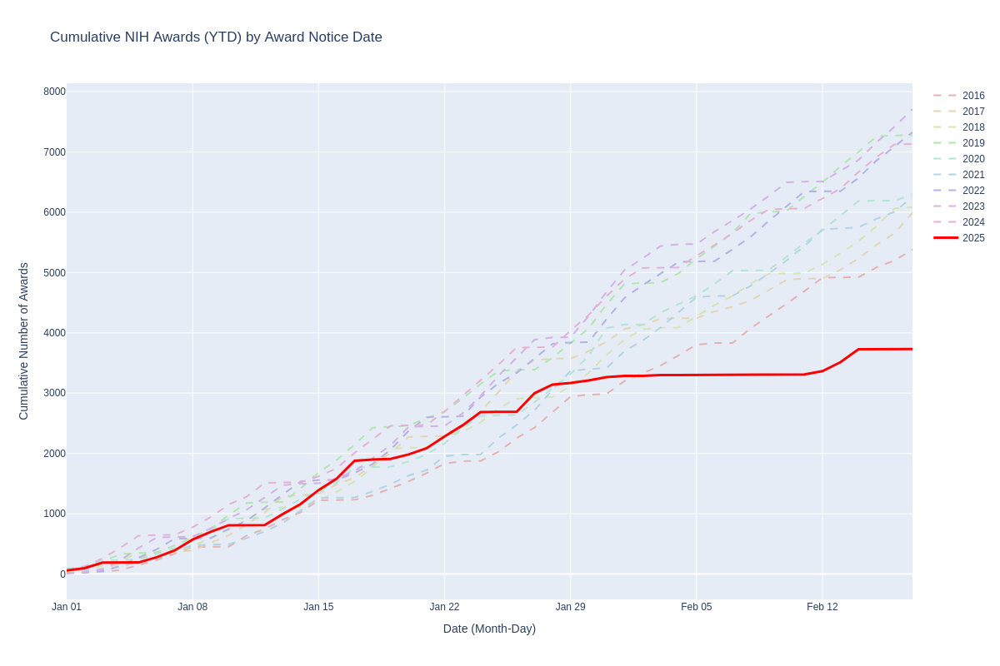
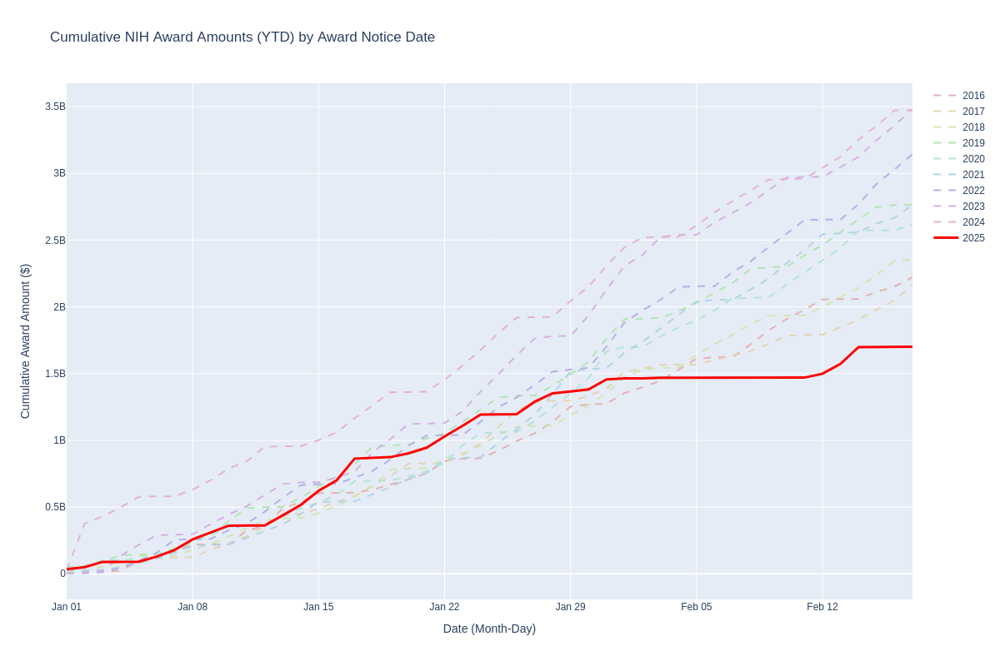

# NIH RePORTER reporter
Like the 80s band [Mr. Mister](https://youtu.be/9NDjt4FzFWY?si=Xc0q9_-9YjigdgIX), this is the RePORTER reporter. It generates a plot of cumulative grant awards announced in [NIH RePORTER](https://reporter.nih.gov) by date, comparing the current year to the previous nine. This can identify trends in award disbursement.

It uses the [RePORTER API](https://api.reporter.nih.gov) to retrieve all grants by `award_notice_date` and then creates the output graph. I think that this includes awards that are both newly awarded and non-competing renewals.

This should update daily, though I'm new to using GitHub Actions.

## Caveats
- There may be delays between award notices sent to investigators and their appearance in RePORTER, so that may introduce artifactual lag for the most recent days.
- Based on a spot check of NIH RePORTER web captures in the [Internet Archive Wayback Machine](https://web.archive.org/web/20241206064251/https://reporter.nih.gov/) data is refreshed on Sundays.
- I am not an expert on NIH RePORTER and rely on `award_notice_date` as an indicator. There may be subtleties to how RePORTER works that distort these results.
- One of the grant months didn't load correctly initially and I had to repopulate it by regenerating the cache. If there are flatlines for any month, please let me know so I can check for an error in the API call results.
- I'm a virologist, not a proper data scientist. So I welcome any and all constructive feedback from those who find problems or areas of improvement.
- I'm spot checking the results but there is no guarantee of accuracy.
- On 2025-02-13 I tried to compress the cache files and use smarter logic to find new grants, but for several hours the display had information that I don't think was accurate. I reverted the code and as of 2025-02-13 the number of 2025 grants matches the number retrieved from the web RePORTER interface (3309). I spot checked the same date range in 2020 and the plot shows the same value as the web interface (5937). The date range on the web search is set to 2020-01-01 to 2020-02-14 and I'm not sure how this search handles boundary dates, though the numbers match exactly.

## Latest Cumulative Award Count Plot

[Interactive Version (Award Counts)](https://dhoconno.github.io/reporter/nih_awards.html)

## Latest Cumulative Award Amount Plot

Inspired by [this analysis in the NYT](https://www.nytimes.com/2025/02/14/health/national-institutes-of-health-research-grants.html), I've also added plots of funding amounts to the plots.

[Interactive Version (Award Amounts)](https://dhoconno.github.io/reporter/nih_award_amounts.html)

## Acknowledgements
- ChatGPT o3-mini-high and Claude Sonnet assisted with deciphering the RePORTER API format and preparing the plots and GitHub Actions.
